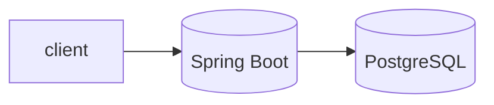

# App

[](https://github.com/OWNER/spring-boot-ai-sample/actions/workflows/ci.yml)
[](https://github.com/OWNER/spring-boot-ai-sample/actions/workflows/codeql.yml)
[](LICENSE)

## Table of Contents
- [Quickstart](#quickstart)
- [Architecture](#architecture)
- [Scripts](#scripts)
- [Contributing](#contributing)
- [Roadmap](#roadmap)
- [License](#license)

## Quickstart
```sh
# build and run
./mvnw -q spring-boot:run
# or via Docker
make docker-build
docker-compose up
```

## Architecture


## Scripts
| Target | Description |
|--------|-------------|
| `make build` | Package the application |
| `make test` | Run tests |
| `make run` | Start the app |
| `make docker-build` | Build Docker image |
| `make up` | Start app and database |
| `make clean` | Clean build artifacts |

## Contributing
See [CONTRIBUTING.md](CONTRIBUTING.md) for guidelines.

## Roadmap
- [ ] Add more endpoints
- [ ] Production database migrations
- [ ] Observability features

## License
Released under the [MIT License](LICENSE).